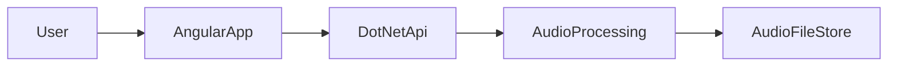
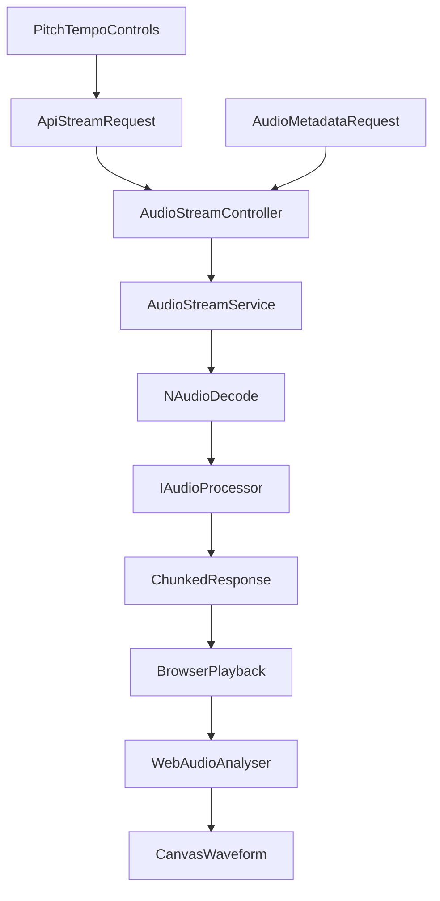

# Architecture for Pitch-Shifter Demo

This architecture follows the stack defined in `docs/STACK.md` and focuses on a backend-centric audio processing flow with an Angular client for controls and visualization.

## System context

## Core components
### Frontend (Angular)
- **Player UI**: play/pause, seek, tempo/pitch sliders, preserve-pitch toggle.
- **Waveform UI**: planned (not yet implemented).
- **Audio API wiring**: builds `/api/audio/stream` URL with processing params and fetches `/api/audio/metadata` for duration.

### Backend (.NET)
- **AudioStreamController**: HTTP streaming endpoint.
- **AudioStreamService**: orchestrates file read, buffering, and streaming.
- **IAudioProcessor**: abstraction for pitch/tempo processing.
- **NAudio pipeline**: decode source audio into sample buffers.
 - **Metadata endpoint**: `/api/audio/metadata` returns source/processed duration.

## Request and streaming flow

## Responsibilities and boundaries
- **Frontend**: user interaction, visualization, and lightweight audio analysis.
- **Backend**: heavy audio processing and streaming, stateless per request. Processed streams use MP3 for size and do not support range.
- **Processing layer**: isolated behind `IAudioProcessor` for easy swapping (simple stretch vs phase vocoder later). We will implement a library that does the processing first and the as a separate project the processing on our own.

## Non-functional considerations
- **Latency**: chunked streaming, small buffers, async I/O.
- **Performance**: throttled/debounced slider events (RxJS).
- **Scalability**: stateless API, no in-memory session state.
- **Reliability**: fallback to original audio stream if processing fails.

## Deployment layout (free tier)
- **Frontend**: Azure Static Web Apps (or Vercel/Netlify).
- **Backend**: Azure App Service Free (or Render/Fly.io).
- **Notes**: expect cold starts; keep sample files small for demo.
